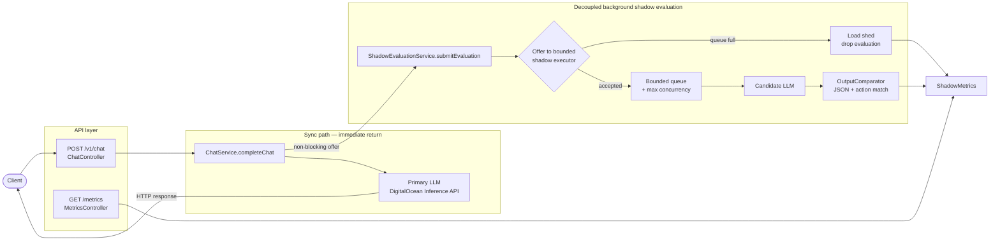

# llm-shadow-router

A Spring Boot service that implements the **shadow deployment** pattern for LLMs:

- `POST /v1/chat` forwards the payload to a **primary** model on DigitalOcean's
  serverless inference API and returns its response to the caller immediately.
- The exact same payload is offered to a **bounded** background executor that
  calls a **candidate** model, compares outputs, and updates metrics.
- Under heavy traffic, when the shadow pool is saturated, background evaluations
  are **load-shed** (dropped) so memory and the primary request path stay healthy.
- Mismatched primary/candidate outputs are written asynchronously to a local
  **SQLite** file for debugging (`GET /traces`).
- Shadow mirror rate is runtime-tunable via **`PUT /config`**
  (`shadowRoutingPercentage`, e.g. `100` → `50`).

## Architecture

```
                         +---------------------------+
                         |        API layer          |
  Client --- POST /v1/chat -->| ChatController         |
         \                   | MetricsController      |
          \  GET /metrics    +------------+----------+
           \                              |
            \                             v
             \               +------------+----------+
              \              |      ChatService      |
               \             |   completeChat(...)   |
                \            +------+--------+-------+
                 \                  |        |
                  \     sync path   |        | non-blocking offer
                   \                v        v
                    \    +----------+--+  +--+---------------------------+
                     \   | Primary LLM |  | ShadowEvaluationService      |
                      \  | (awaited)   |  | submitEvaluation(...)        |
                       \ +------+------+  +------+-----------------------+
                        \       |                |
                         \      | HTTP response  | bounded executor
                          \     v                v
                           \  Client      +------+-------+
                            \             | accept/queue |
                             \            +--+--------+--+
                              \              |        |
                               \             | full   | accepted
                                \            v        v
                                 \         shed    Candidate LLM
                                  \          |        |
                                   \         v        v
                                    \   ShadowMetrics <--- compare (action match)
                                     \                     |
                                      \                    +--> SQLite mismatches (async)
```

**Sync path (immediate return):**  
`Client` → `ChatController` → `ChatService.completeChat` → primary LLM → response to client.

**Decoupled background path:**  
`ChatService` (routing %) → `ShadowEvaluationService` → bounded queue/pool → candidate LLM → compare → metrics; mismatches → SQLite.

**Load shedding:** when concurrency + queue are full, the shadow task is dropped; the chat response is unchanged.



## Requirements

- Java 21+ and Maven 3.9+ **or** Docker
- A DigitalOcean [model access key](https://docs.digitalocean.com/products/gradient-ai-platform/how-to/use-serverless-inference/)

## CI

On every push, GitHub Actions runs the full Maven test suite (`.github/workflows/ci.yml`):

- Ubuntu runner
- Temurin JDK 21
- Maven dependency cache
- `mvn -B test`

No DigitalOcean credentials are required in CI; tests mock or stub the inference API.

## Configuration

All settings come from environment variables (see `.env.example`):

| Variable | Default | Purpose |
|---|---|---|
| `DO_INFERENCE_BASE_URL` | `https://inference.do-ai.run/v1` | OpenAI-compatible base URL |
| `DO_MODEL_ACCESS_KEY` | (required) | Bearer token for the inference API |
| `PRIMARY_MODEL` | `llama3.3-70b-instruct` | Model that answers the user |
| `CANDIDATE_MODEL` | `openai-gpt-oss-120b` | Model that receives the mirrored payload |
| `PRIMARY_TIMEOUT` | `60s` | Timeout for the user-facing call |
| `CANDIDATE_TIMEOUT` | `90s` | Timeout for the background shadow call |
| `SHADOW_MAX_CONCURRENCY` | `32` | Max concurrent background shadow evaluations |
| `SHADOW_QUEUE_CAPACITY` | `128` | Max queued shadow tasks before shedding |
| `SHADOW_ROUTING_PERCENTAGE` | `100` | Initial % of requests mirrored to candidate |
| `SHADOW_SQLITE_PATH` | `./data/shadow-mismatches.db` | SQLite file for mismatch traces |

## Run locally

```bash
cp .env.example .env   # fill in DO_MODEL_ACCESS_KEY
set -a && source .env && set +a
mvn spring-boot:run
```

## Run with Docker

Build a portable image (Java/Maven not required on the host):

```bash
docker build -t llm-shadow-router .
```

Run it (pass your model access key and mount a volume for SQLite traces):

```bash
docker run --rm -p 8080:8080 \
  -e DO_MODEL_ACCESS_KEY="your-model-access-key-here" \
  -e PRIMARY_MODEL="llama3.3-70b-instruct" \
  -e CANDIDATE_MODEL="openai-gpt-oss-120b" \
  -v llm-shadow-data:/app/data \
  llm-shadow-router
```

Or load variables from a `.env` file:

```bash
cp .env.example .env   # fill in DO_MODEL_ACCESS_KEY
docker run --rm -p 8080:8080 --env-file .env \
  -v llm-shadow-data:/app/data \
  llm-shadow-router
```

The multi-stage `Dockerfile` builds the Spring Boot jar with Maven, then runs it
on a slim Eclipse Temurin 21 JRE image. Mismatch traces are written to
`/app/data/shadow-mismatches.db` inside the container (`SHADOW_SQLITE_PATH`).

## Step-by-step: curl usage (mutate config & observe metrics)

Assume the service is running on `http://localhost:8080` and `DO_MODEL_ACCESS_KEY` is set.

### 1. Baseline metrics (should start near zeros)

```bash
curl -s http://localhost:8080/metrics | jq
```

### 2. Send a chat request (primary answers; shadow may run in background)

```bash
curl -s http://localhost:8080/v1/chat \
  -H "Content-Type: application/json" \
  -d '{
    "messages": [
      {"role": "user", "content": "Reply with JSON only: {\"action\":\"retry\"}"}
    ],
    "max_tokens": 64
  }' | jq
```

The HTTP response is the **primary** model body only (`X-Request-Id` is set for log correlation).

### 3. Re-check metrics (counters should move)

```bash
curl -s http://localhost:8080/metrics | jq
```

Expect `totalRequestsProcessed` to increase. After the shadow path finishes, also watch:

- `comparisonsEvaluated`
- `exactActionMatches` / `exactMatchRatePercentage`
- `shadowErrorsOrTimeouts` (if candidate failed)
- `mismatchTracesPersisted` (if actions differed)

Example shape:

```json
{
  "totalRequestsProcessed": 1,
  "shadowErrorsOrTimeouts": 0,
  "shadowEvaluationsShed": 0,
  "shadowRoutingSkipped": 0,
  "comparisonsEvaluated": 1,
  "exactActionMatches": 1,
  "exactMatchRatePercentage": 100.0,
  "mismatchTracesPersisted": 0,
  "mismatchTracesShed": 0,
  "mismatchTraceErrors": 0
}
```

### 4. Throttle shadow mirroring to 50% (runtime config)

```bash
curl -s -X PUT http://localhost:8080/config \
  -H "Content-Type: application/json" \
  -d '{"shadowRoutingPercentage": 50}' | jq
```

Confirm:

```bash
curl -s http://localhost:8080/config | jq
# {"shadowRoutingPercentage":50}
```

### 5. Generate more traffic and watch skip / shed counters

```bash
for i in $(seq 1 10); do
  curl -s http://localhost:8080/v1/chat \
    -H "Content-Type: application/json" \
    -d "{\"messages\":[{\"role\":\"user\",\"content\":\"ping $i — reply {\\\"action\\\":\\\"continue\\\"}\"}]}" \
    > /dev/null
done

curl -s http://localhost:8080/metrics | jq
```

With percentage `50`, roughly half of requests should increment `shadowRoutingSkipped`
(no candidate call). Under heavy load, `shadowEvaluationsShed` rises when the bounded
shadow queue is full.

### 6. Inspect mismatch traces (debugging / visualization)

```bash
curl -s "http://localhost:8080/traces?limit=20" | jq
```

Each row includes `requestId`, request payload, primary/candidate bodies, and extracted
`action` values when a comparison was not an exact match.

### 7. Restore full mirroring

```bash
curl -s -X PUT http://localhost:8080/config \
  -H "Content-Type: application/json" \
  -d '{"shadowRoutingPercentage": 100}' | jq
```

Invalid values are rejected:

```bash
curl -s -X PUT http://localhost:8080/config \
  -H "Content-Type: application/json" \
  -d '{"shadowRoutingPercentage": 150}'
# {"error":"shadowRoutingPercentage must be between 0 and 100 ..."}  (or validation message)
```

## How memory footprint is bounded under load

This service is designed so a traffic burst cannot grow unbounded background work or
payload retention. Memory is capped by **fixed-size queues**, **concurrency limits**,
and **probabilistic sampling**.

| Boundary | Default | What it limits |
|---|---|---|
| Shadow executor concurrency | `SHADOW_MAX_CONCURRENCY=32` | Max in-flight candidate HTTP calls (+ held payloads) |
| Shadow work queue | `SHADOW_QUEUE_CAPACITY=128` | Max pending shadow tasks waiting for a worker |
| Shadow offer policy | `AbortPolicy` (shed) | When workers + queue are full, new shadow work is **dropped** |
| Routing percentage | `PUT /config` / `SHADOW_ROUTING_PERCENTAGE` | Fraction of requests that even attempt mirroring |
| Mismatch SQLite write queue | 256 | Max pending disk writes for mismatch traces |
| Trace write policy | `AbortPolicy` (shed) | Extra mismatches are dropped if the write queue is saturated |

**What this means in practice**

1. **Primary path stays lean.** `/v1/chat` awaits only the primary model. Candidate work
   never blocks the response, so client concurrency is not multiplied by shadow latency.
2. **Shadow queue cannot grow without limit.** At most
   `concurrency + queueCapacity` shadow payloads are retained in memory. Further offers
   increment `shadowEvaluationsShed` and free the request thread immediately.
3. **Routing % reduces admission.** At `50`, about half of requests never allocate a
   shadow deep-copy or queue slot (`shadowRoutingSkipped`).
4. **Mismatch persistence is decoupled and bounded.** SQLite inserts run on a separate
   single-threaded queue. Shadow workers enqueue and continue; if that queue is full,
   the trace is shed (`mismatchTracesShed`) instead of buffering forever.
5. **Metrics are fixed-size counters.** `ShadowMetrics` uses `AtomicLong`s — O(1) memory
   regardless of traffic volume.

Rough upper bound for in-flight shadow memory (order of magnitude):

```text
shadow_held ≈ (SHADOW_MAX_CONCURRENCY + SHADOW_QUEUE_CAPACITY) × avg_payload_size
            + mismatch_write_queue(≤256) × avg_trace_size
```

Tune `SHADOW_MAX_CONCURRENCY` / `SHADOW_QUEUE_CAPACITY` / `shadowRoutingPercentage`
down under memory pressure; the chat endpoint continues serving primary traffic.

## How it works

- `ChatService` owns the user response: primary inference only.
- Before offering shadow work, it applies `shadowRoutingPercentage` (runtime config).
- `ShadowEvaluationService` owns candidate inference, comparison, and load shedding.
- Shadow work uses a `ThreadPoolExecutor` with fixed concurrency and a fixed-size
  `ArrayBlockingQueue`. Overflow uses `AbortPolicy` → task dropped.
- When `action` values differ (or either side lacks a matchable action), the request
  payload plus both model bodies are queued to SQLite via `MismatchTraceService`.
- `PUT /config` updates mirroring percentage without restart; `GET /traces` reads
  recent mismatches for debugging/visualization.
- Any `model` field in the incoming payload is overridden per call so both models
  receive the identical prompt.
